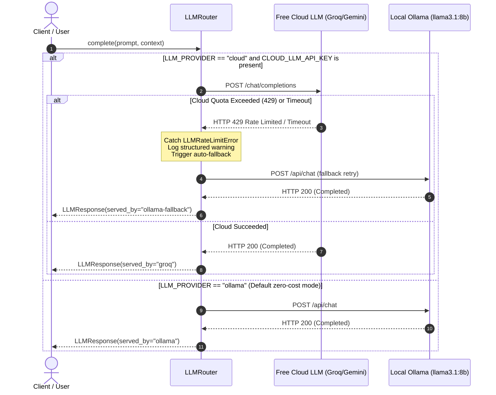
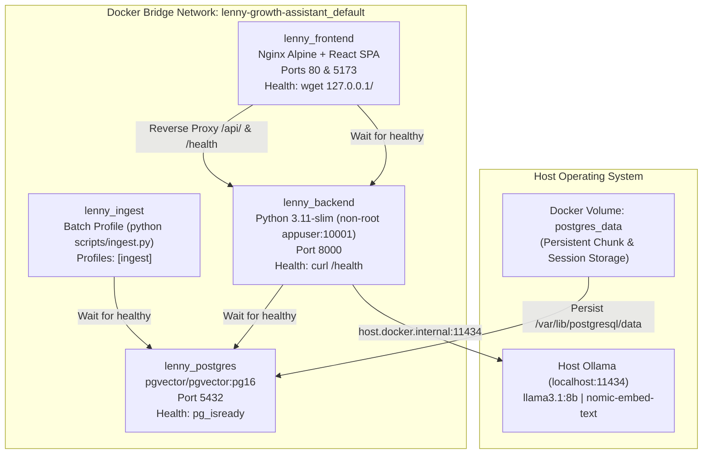

# System Architecture Specification — The Lenny Growth Assistant

**Project**: The Lenny Growth Assistant  
**Author**: Forward-Deployed AI Engineering Team  
**Status**: Production / Complete (Phase 3)  
**Version**: 1.0.0  

---

## 1. High-Level Architecture

The Lenny Growth Assistant is a local-first, zero-cost AI system combining semantic vector retrieval over 269 podcast transcripts with an asynchronous Python agent loop and a sandboxed React workspace.

```mermaid
flowchart TB
    subgraph Client["Client Browser (Port 80 / 5173)"]
        UI[React 19 + Vite SPA]
        Viewer[Sandboxed Artifact Viewer\nDOMPurify + CSP + iframe]
    end

    subgraph ReverseProxy["Edge / Reverse Proxy"]
        Nginx[Nginx 1.31 Alpine\nStatic Assets | API Proxy | Request Tracing]
    end

    subgraph Backend["FastAPI Backend (Port 8000)"]
        Router[API Routers\n/chat, /sessions, /artifacts, /health, /config]
        Middleware[Middleware\nTraceMiddleware (X-Request-ID) | Error Envelopes]
        Agent[Grounded RAG Agent Loop]
        LLMRouter[Resilient LLM Router]
        Skills[Skill Engine\nShip 30 for 30 | Markdown | HTML]
    end

    subgraph Storage["Storage & Vector Layer (Port 5432)"]
        PG[(PostgreSQL 16 + pgvector\nchunks, processed_files, sessions, messages, artifacts)]
        HNSW[HNSW Vector Cosine Index]
    end

    subgraph Inference["Inference Providers"]
        Ollama[(Local Ollama\nllama3.1:8b | nomic-embed-text)]
        Cloud[(Free Cloud LLM\nGroq Llama 3.3 | Gemini Flash)]
    end

    UI -->|HTTP / SPA Navigation| Nginx
    Nginx -->|Proxy /api/ & /health| Router
    Router --> Middleware
    Middleware --> Agent
    Agent -->|1. Generate Query Vector| Ollama
    Agent -->|2. Hybrid Cosine Search + Boost| PG
    PG --- HNSW
    Agent -->|3. Assemble Grounded Prompt| LLMRouter
    LLMRouter -->|Primary: Local Zero-Cost| Ollama
    LLMRouter -.->|Optional Toggle: Free Tier| Cloud
    Cloud -.->|Catch 429/Timeout Fallback| Ollama
    Agent --> Skills
    Skills -->|Persist Artifact| PG
    Router -->|Return Grounded JSON| Nginx
    Nginx -->|Deliver Answer & Citations| UI
    UI -->|Render HTML/Markdown Widget| Viewer
```

---

## 2. Zero-Cost Technology Stack Matrix

| Layer | Technology | Cost | Function in Architecture |
| :--- | :--- | :--- | :--- |
| **Storage & Vectors** | PostgreSQL 16 + `pgvector` | $0.00 | Relational database storing session state, chat history, artifacts, and 768-dim embeddings with HNSW indexing. |
| **Embeddings** | Ollama (`nomic-embed-text`) | $0.00 | Local 768-dimensional dense vector embeddings generated via local Ollama HTTP API. Zero cloud API calls. |
| **Primary LLM** | Ollama (`llama3.1:8b` / `llama3.2:3b`) | $0.00 | Mandatory local inference engine powering Q&A generation, synthesis, and fallback execution. |
| **Cloud LLM Toggle** | Groq (`llama-3.3-70b`) or Gemini | $0.00 | Optional free-tier cloud provider for sub-2-second inference, protected by automated fallback. |
| **Backend API** | FastAPI (Python 3.11+) | $0.00 | Asynchronous REST backend, Pydantic schemas, SQLAlchemy ORM, and context-bound request tracing. |
| **Frontend UI** | React 19 + Vite | $0.00 | High-performance Single-Page Application with dual-pane split view, Markdown rendering, and clipboard/download utilities. |
| **Sandboxed Viewer** | Browser `<iframe sandbox>` + DOMPurify | $0.00 | Mathematical code isolation preventing parent DOM tampering or network exfiltration from untrusted HTML. |
| **Web Server / Proxy** | Nginx Alpine | $0.00 | Production static file server, SPA client fallback router, reverse proxy, and request ID forwarder. |
| **Containerization** | Docker Compose | $0.00 | Self-contained, one-command deployment with volume persistence and healthcheck dependency chains. |

---

## 3. Database Schema Specification

The database runs in PostgreSQL 16 with `pgvector`, `pgcrypto`, and `uuid-ossp` extensions enabled.

```sql
-- Extensions
CREATE EXTENSION IF NOT EXISTS vector;
CREATE EXTENSION IF NOT EXISTS pgcrypto;
CREATE EXTENSION IF NOT EXISTS "uuid-ossp";

-- 1. Transcript Chunks Table (768-dim vector embeddings)
CREATE TABLE IF NOT EXISTS chunks (
    id SERIAL PRIMARY KEY,
    content TEXT NOT NULL,
    embedding vector(768) NOT NULL,
    episode_title VARCHAR(500) NOT NULL,
    guest VARCHAR(255),
    source_url VARCHAR(1000),
    content_hash VARCHAR(64) NOT NULL UNIQUE,
    created_at TIMESTAMP WITH TIME ZONE DEFAULT CURRENT_TIMESTAMP
);

CREATE INDEX IF NOT EXISTS idx_chunks_embedding 
ON chunks USING hnsw (embedding vector_cosine_ops);

CREATE INDEX IF NOT EXISTS idx_chunks_guest 
ON chunks(guest);

CREATE INDEX IF NOT EXISTS idx_chunks_episode 
ON chunks(episode_title);

-- 2. Ingestion File Tracking Table (Idempotency)
CREATE TABLE IF NOT EXISTS processed_files (
    id SERIAL PRIMARY KEY,
    file_path VARCHAR(1000) NOT NULL UNIQUE,
    file_hash VARCHAR(64) NOT NULL,
    chunks_count INTEGER NOT NULL DEFAULT 0,
    processed_at TIMESTAMP WITH TIME ZONE DEFAULT CURRENT_TIMESTAMP
);

CREATE INDEX IF NOT EXISTS idx_processed_files_hash 
ON processed_files(file_hash);

-- 3. Chat Sessions Table
CREATE TABLE IF NOT EXISTS sessions (
    id UUID PRIMARY KEY DEFAULT gen_random_uuid(),
    title VARCHAR(255) NOT NULL DEFAULT 'New Chat',
    metadata JSONB NOT NULL DEFAULT '{}'::jsonb,
    created_at TIMESTAMP WITH TIME ZONE DEFAULT CURRENT_TIMESTAMP,
    updated_at TIMESTAMP WITH TIME ZONE DEFAULT CURRENT_TIMESTAMP
);

CREATE INDEX IF NOT EXISTS idx_sessions_updated_at 
ON sessions(updated_at DESC);

-- 4. Chat Messages Table
CREATE TABLE IF NOT EXISTS messages (
    id UUID PRIMARY KEY DEFAULT gen_random_uuid(),
    session_id UUID NOT NULL REFERENCES sessions(id) ON DELETE CASCADE,
    role VARCHAR(20) NOT NULL,
    content TEXT NOT NULL,
    citations JSONB DEFAULT '[]'::jsonb,
    served_by VARCHAR(50),
    created_at TIMESTAMP WITH TIME ZONE DEFAULT CURRENT_TIMESTAMP
);

CREATE INDEX IF NOT EXISTS idx_messages_session 
ON messages(session_id, created_at ASC);

-- 5. Generated Artifacts Table
CREATE TABLE IF NOT EXISTS artifacts (
    id UUID PRIMARY KEY DEFAULT gen_random_uuid(),
    session_id UUID REFERENCES sessions(id) ON DELETE CASCADE,
    type VARCHAR(50) NOT NULL,
    title VARCHAR(255) NOT NULL,
    content TEXT NOT NULL,
    word_count INTEGER,
    citations JSONB DEFAULT '[]'::jsonb,
    created_at TIMESTAMP WITH TIME ZONE DEFAULT CURRENT_TIMESTAMP
);

CREATE INDEX IF NOT EXISTS idx_artifacts_session 
ON artifacts(session_id, created_at DESC);
```

---

## 4. API Specification & Error Envelopes

All endpoints return predictable JSON structures decorated with `X-Request-ID` and `X-Response-Time-Ms` response headers.

### 4.1 Endpoint Reference Table

| Method | Path | Description | Request Body | Success Response |
| :--- | :--- | :--- | :--- | :--- |
| `GET` | `/health` | Multi-component granular health status | None | `200 OK`: `{"status":"healthy","dependencies":{"postgres":{...},"ollama":{...}}}` |
| `POST` | `/api/chat` | Grounded RAG conversation endpoint | `{"message": str, "session_id": UUID?}` | `200 OK`: `{"session_id": UUID, "content": str, "citations": [...], "served_by": str, "is_grounded": bool}` |
| `GET` | `/api/sessions` | List sessions ordered by `updated_at DESC` | None | `200 OK`: `[{"id": UUID, "title": str, "updated_at": str, ...}]` |
| `POST` | `/api/sessions` | Create a new session explicitly | `{"title": str?, "metadata": obj?}` | `201 Created`: `{"id": UUID, "title": str, "metadata": {...}}` |
| `GET` | `/api/sessions/{id}` | Get session details and message history | None | `200 OK`: `{"id": UUID, "title": str, "messages": [...]}` |
| `DELETE` | `/api/sessions/{id}` | Delete session (cascades to messages/artifacts)| None | `204 No Content` |
| `POST` | `/api/artifacts/generate` | Synthesize answer into Ship30/Markdown/HTML | `{"session_id": UUID, "artifact_type": str, ...}` | `200 OK`: `{"id": UUID, "type": str, "title": str, "content": str, "word_count": int}` |
| `GET` | `/api/artifacts/{id}` | Retrieve generated artifact by ID | None | `200 OK`: `{"id": UUID, "type": str, "title": str, "content": str, ...}` |
| `GET` | `/api/llm/config` | Introspect active LLM router state | None | `200 OK`: `{"current_provider": str, "ollama_model": str, "cloud_configured": bool}` |

### 4.2 Standardized Error Envelope (Zero Raw Stack Traces)

The backend never exposes raw SQL queries, tracebacks, or framework internals to clients or evaluators. Errors are trapped by `TraceMiddleware` and global exception handlers, returning a standardized JSON envelope:

```json
{
  "error": {
    "code": "DATABASE_UNAVAILABLE",
    "message": "The database is currently unreachable. Please ensure the PostgreSQL container is running.",
    "request_id": "b3c6a7e2-4821-4b3f-9171-84197e889d12",
    "status_code": 503
  },
  "detail": "The database is currently unreachable. Please ensure the PostgreSQL container is running."
}
```

Standardized Error Codes:
- `DATABASE_UNAVAILABLE` (503): Database connection refused or query dropped.
- `OLLAMA_UNAVAILABLE` (503): Local Ollama service is unreachable on port 11434.
- `SESSION_NOT_FOUND` (404): Session UUID does not exist.
- `VALIDATION_ERROR` (422): Input body failed Pydantic schema validation.
- `INTERNAL_SERVER_ERROR` (500): Generic unhandled exception caught safely with trace logged internally.

---

## 5. Data Ingestion & Grounded Retrieval Flow

### 5.1 Ingestion & Chunking Algorithm (`scripts/ingest.py`, `scripts/chunker.py`)
1. **Source Discovery**: Ingests 269 Markdown transcript files from `data/raw/lennys-podcast-transcripts`.
2. **Metadata Parsing**: Frontmatter parsed via `python-frontmatter` to extract `title`, `guest`, `date`, and `url`.
3. **Heading & Speaker Boundary Splitting**:
   - Transcripts are split across speaker markers (e.g. `Lenny:`, `**Guest:**`) and Markdown headings (`#`, `##`, `###`).
   - Token counter (`tiktoken` `cl100k_base`) ensures chunks average **600–800 tokens** with **100-token overlap** between adjacent windows.
   - Prepends episode title and guest context to every chunk header so embeddings retain speaker context.
4. **Idempotent Hash Fingerprinting**:
   - Computes SHA-256 hash of raw file contents and individual chunk texts.
   - Skips already-ingested files; `--refresh` mode only embeds new or modified episodes.

### 5.2 Grounded Retrieval & Hybrid Reranking
1. **Query Embedding**: The user query is converted into a 768-dim float vector via Ollama `nomic-embed-text`.
2. **Cosine Vector Distance**:
   ```sql
   SELECT id, content, episode_title, guest, source_url, content_hash,
          (embedding <=> :query_embedding) AS distance,
          (1 - (embedding <=> :query_embedding)) AS base_similarity
   FROM chunks
   ORDER BY distance ASC
   LIMIT :candidate_limit;
   ```
3. **Keyword Boost Algorithm**:
   - Queries are tokenized for key terms (guest names, framework acronyms like "PLG", "CAC", "LTV").
   - Candidate chunks receive scoring boosts:
     - `+0.05` if guest name matches query terms.
     - `+0.03` if episode title matches query terms.
4. **Anti-Hallucination Threshold Filtering**:
   - If the top candidate similarity score is below the threshold (`0.40`), the retriever drops all chunks and triggers the strict refusal response:
     > *"I couldn't find coverage of this topic in the available Lenny's Podcast transcripts. I can only answer questions related to product management, growth, hiring, and startup strategy covered in the podcast."*
   - Prevents hallucinations on off-topic questions.

---

## 6. LLM Router & Automated Resilience Topology

The LLM Router (`backend/app/services/llm/router.py`) guarantees zero user-facing downtime when operating with cloud LLM providers:



---

## 7. Container Topology & Deployment Architecture

Docker Compose deploys the complete stack across 3 continuous services and 1 batch profile:



### Security Highlights
- **Unprivileged Non-Root User**: `backend/Dockerfile` runs as system user `appuser` (UID 10001, GID 10001) preventing container escape vulnerabilities.
- **Zero Exposed Database Outside Host**: PostgreSQL port 5432 binds to local interface only.
- **Data Persistence**: `postgres_data` volume survives container rebuilds, code updates, and teardowns.
